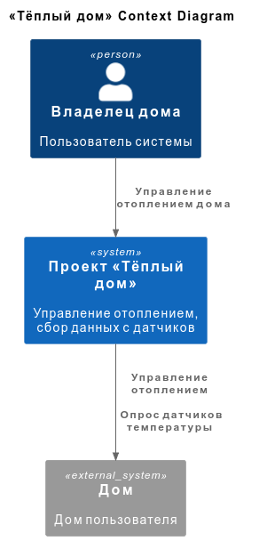
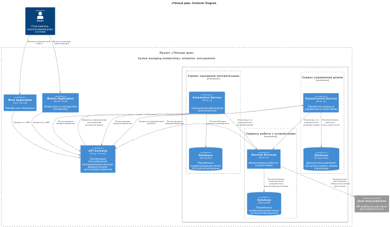
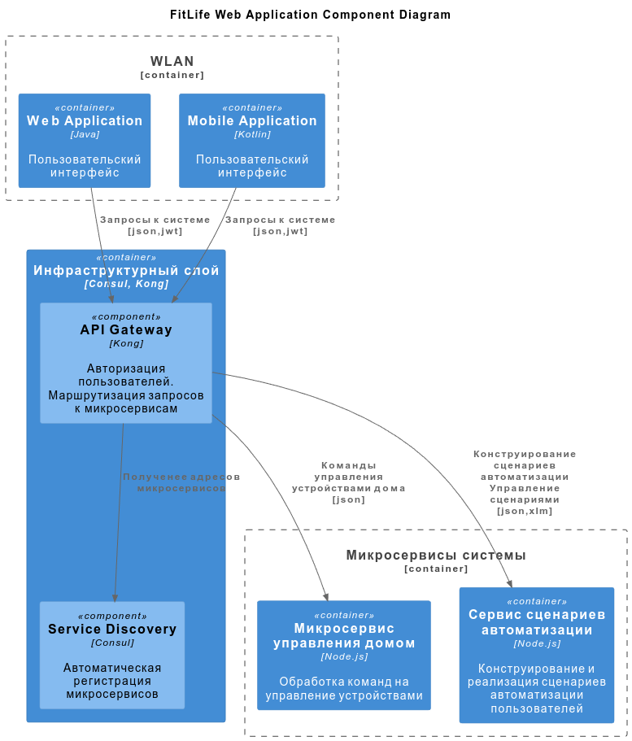
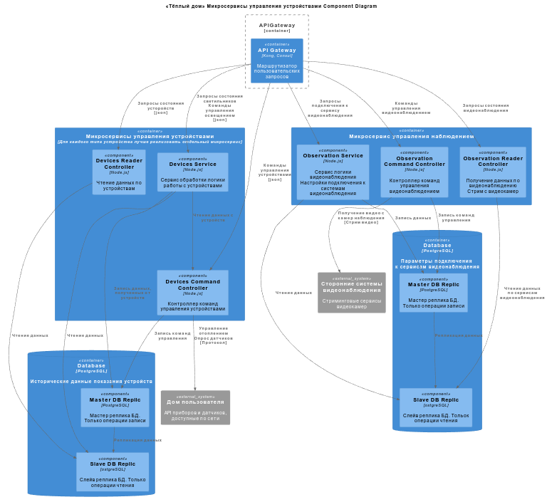
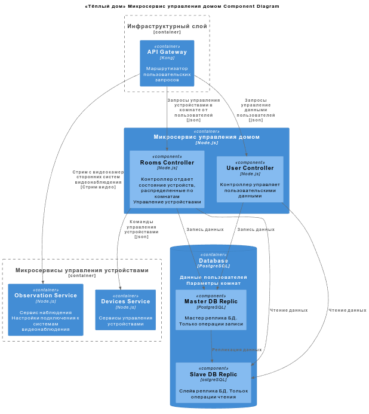
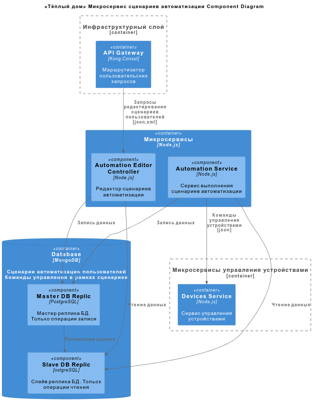
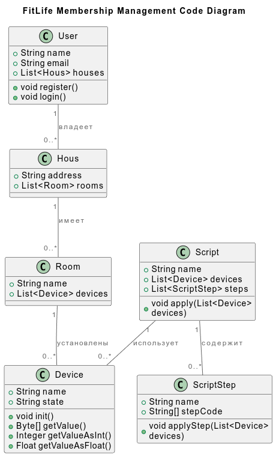
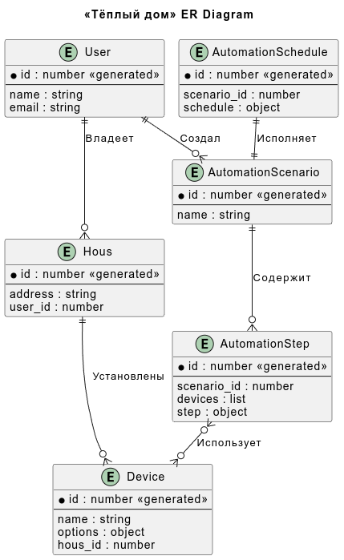

# Project_template

Тип: Материал
Родитель: Описание проекта для 11 когорты (https://www.notion.so/11-03abbbbc8bcb49ed9b85c9b6d1174056?pvs=21)

Это шаблон для решения проектной работы. Структура этого файла повторяет структуру заданий. Заполняйте его по мере работы над решением.

# Задание 1. Анализ и планирование

### 1. Описание функциональности монолитного приложения

Проект "Smart Home Monolith" представляет собой монолитное приложение для управления отоплением и мониторинга температуры в умном доме.
Приложение запущено на серверах компании и централизованно обслуживает все заросы пользователей.

Что бы подключить новый дом к системе требуется выезд специалиста по подключению системы отопления в доме к текущей версии системы. 
Он подключает новые датчики и регистрирует их в системе скорее всего через спецальный модуль ввода-вывода. Все датчики орашиваются приложением. 

Пользователю доступны следующие возможности.

**Управление отоплением:**

- Пользователи могут удалённо включать/выключать отопление в своих домах.
- Система поддерживает включение или отключение отопления во всем доме по запросу от пользователя. 

**Мониторинг температуры:**

- Пользователи могут просматривать текущую температуру в своих домах через веб-интерфейс.
- Система опрашивает датчики температуры, установленные в домах, и сохраняет их показания в базе.

### 2. Анализ архитектуры монолитного приложения

**Язык программирования:** Java

**База данных:** PostgreSQL

**Архитектура:** Монолитная, все компоненты системы (обработка запросов, бизнес-логика, работа с данными) находятся в рамках одного приложения.

**Взаимодействие:** Синхронное, запросы обрабатываются последовательно.

**Масштабируемость:** Ограничена, так как монолит сложно масштабировать по частям.

**Развёртывание:** Требует остановки всего приложения.

### 3. Определение доменов и границы контекстов

Опишите здесь домены, которые вы выделили.

1) **Инфраструктурный слой**. API Gateway который будет отвечать за авторизацию пользователей, маршрутизацию запросов.

2) **Домен управления устройствами**. Поскольку устройства могут быть различные, то лучше всего под каждый тип устройства реализовать отдельный микросервис. Эти микросервисы будут отвечать за опрос устройств и отправку команд управления.  

3) **Домен управления домом**. Основной сервис, который будет предоставлять функции управления устройствами дома, просмотр их состояния. Команды управления отправляются на микросервисы управления устройствами.   

4) **Домен сценариев автоматизации**. Этот сервис позволяет пользователям создавать свои сценарии автоматизации устройств своего дома. Команды управления отправляются на микросервисы управления устройствами.

### **4. Проблемы монолитного решения**

- Опрос датчиков температур может быть слишком долгим из-за недоступности некоторых датчиков.
- Внедрение новой бизнес-логики требует больших затрат на внедрение. 
- В связи с ростом подключений требуется масштабировать приложение, что тяжело будет сделать в рамках монолитной системы. Нужно будет вертикально наращивать мощности серверов. 
- 

### 5. Визуализация контекста системы — диаграмма С4

Добавьте сюда диаграмму контекста в модели C4.

[Диаграмма Context](docs/site/context/index.html)

# Задание 2. Проектирование микросервисной архитектуры

В этом задании вам нужно предоставить только диаграммы в модели C4. Мы не просим вас отдельно описывать получившиеся микросервисы и то, как вы определили взаимодействия между компонентами To-Be системы. Если вы правильно подготовите диаграммы C4, они и так это покажут.

**Диаграмма контейнеров (Containers)**

[Диаграмма Containers](docs/site/context/index.html)

**Диаграмма компонентов (Components)**

[Диаграмма компонентов API Gateway](docs/site/components_gateway/index.html)

[Диаграмма компонентов Микросервисов управления устройствами](docs/site/components_devices/index.html)

[Диаграмма компонентов Микросервиса управления домом](docs/site/components_house/index.html)

[Диаграмма компонентов Микросервиса сценариев автоматизации](docs/site/components_automation/index.html)

**Диаграмма кода (Code)**

[Диаграмма базовых классов](docs/site/code/index.html)

# Задание 3. Разработка ER-диаграммы

Добавьте сюда ER-диаграмму. Она должна отражать ключевые сущности системы, их атрибуты и тип связей между ними.

[ER диаграмма компонентов](docs/site/er/index.html)

# ❌ Задание 4. Создание и документирование API

### 1. Тип API

FULLRest Json. Пользователю требуется сразу видеть результаты отправки команды на устройтсво. Поэтому команды управления устройствами с использованием синхронного вызова. Для масштабирования модно увеличивать число инстансов микросервисов устройств. Если в дальнейшем это будет узкое место, то можно попробовать внедрить очередь на базе Kafka.
Для быстрого внедрения видеонаблюдение можно использовать стороннего вендора и с ним наладить связи. Пробросить видеостримс камер. Если в дальнейшем  
