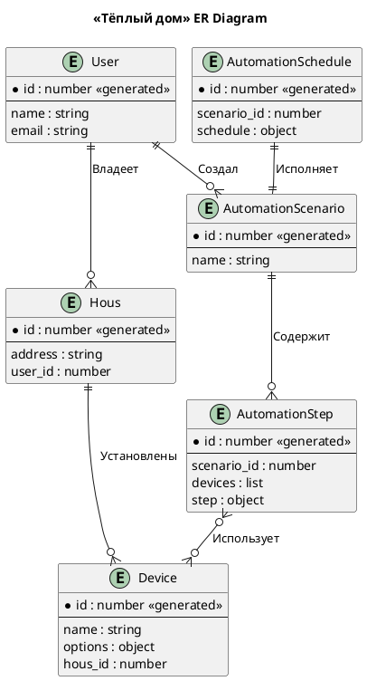

```plantuml
@startuml
!pragma layout smetana
title «Тёплый дом» ER Diagram

top to bottom direction

entity User {
  *id : number <<generated>>
  --
  name : string
  email : string
}

entity Hous {
  *id : number <<generated>>
  --
  address : string
  user_id : number
}

entity Device {
  *id : number <<generated>>
  --
  name : string
  options : object
  hous_id : number
}


entity AutomationScenario {
  *id : number <<generated>>
  --
  name : string
}

entity AutomationStep {
  *id : number <<generated>>
  --
  scenario_id : number
  devices : list
  step : object
}

entity AutomationSchedule {
  *id : number <<generated>>
  --
  scenario_id : number
  schedule : object
}

User ||--o{ Hous : Владеет 
Hous ||--o{ Device : Установлены 
User ||--o{ AutomationScenario : Создал 
AutomationScenario ||--o{ AutomationStep : Содержит 
AutomationStep }o--o{ Device : Использует
AutomationSchedule ||--|| AutomationScenario : Исполняет

@enduml
```